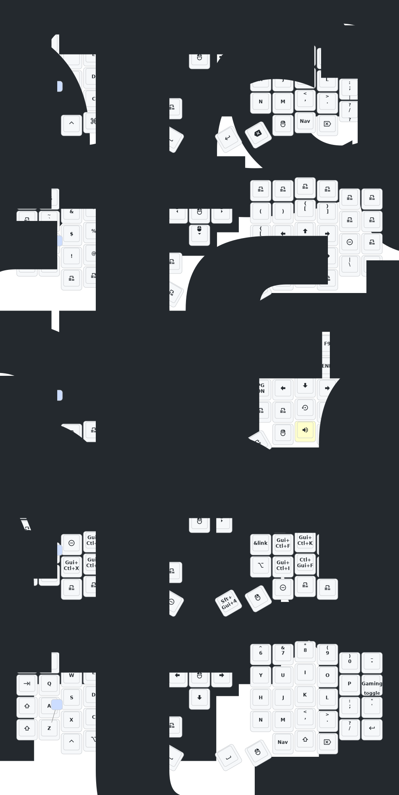

# Eyelash Sofle ZMK Config

ZMK firmware configuration for the **Eyelash Sofle** split keyboard.

## Update History

- **2024/12/21** — Added ZMK Studio support (flash left half to enable).
- **2024/10/24** — Reduced power consumption; fixed RGB auto-off on power.
- **2025/3/30** — Increased idle sleep timeout to 1 hour; improved debounce and post-sleep power usage.
- **2025/8/22**
  1. Added soft-off: hold Q + S + Z for 2 seconds to enter deep sleep. Press reset switch once to wake.
  2. Updated ultra-thin cases for Sofle and Corne — thicker frame/base, improved reset button access.
  3. Removed GIF animations from right-hand screen to reduce power consumption.

> If your keyboard firmware is older than 2025/8/22, update to the latest firmware.

## Keymap

## Contact

For 3D model files or hardware issues: 380465425@qq.com
